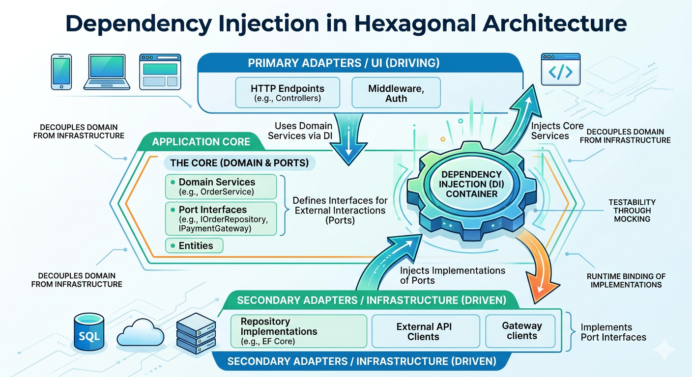
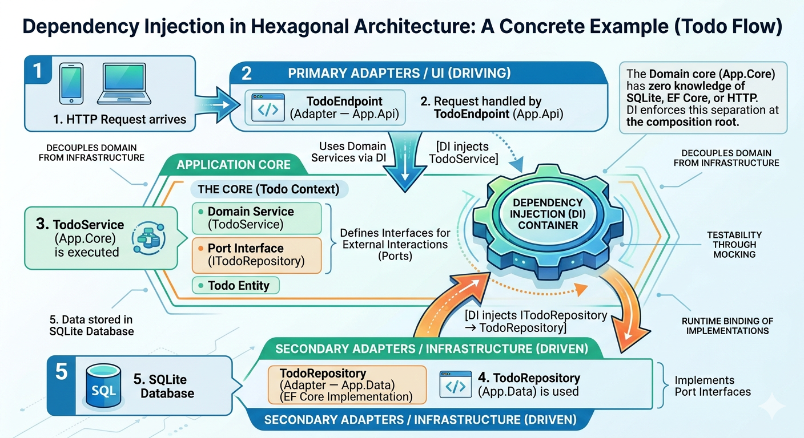

# Dependency Injection: The Core Foundation for Implementing Dependency Inversion Principle

**This is Part 2 of the .NET Architecture series.**

- Part 1 — [Dependency Inversion Principle: The Foundation of Sustainable Architecture](https://medium.com/@hieunv/dependency-inversion-principle-the-foundation-of-sustainable-architecture-d3f096c8a3ec?source=friends_link&sk=90c7967b4f244428c1e5319ff485654c)
- **Part 2 — Dependency Injection: The Core Foundation for Implementing Dependency Inversion Principle** _(this post)_
Part 3 — [Mastering Hexagonal Architecture in .NET: A Practical Guide](https://medium.com/@hieunv/mastering-hexagonal-architecture-in-net-a-practical-guide-6651752e6baa?source=friends_link&sk=91dc7ef74051997e2bbc7080f4aa5d93)

---

## Introduction

Dependency Injection (DI) is not merely a design pattern or framework feature—it is the **fundamental mechanism** that makes the Dependency Inversion Principle (DIP) practically implementable in real-world software systems. While DIP provides the theoretical foundation for building flexible, maintainable architectures, DI serves as the concrete implementation strategy that transforms this principle from concept into working code.

Understanding this relationship is crucial: **DIP defines the "what" and "why" of proper dependency management, while DI provides the "how"**. Without DI, attempting to follow DIP leads to complex, manual dependency management that becomes unwieldy as systems grow. With DI, DIP becomes an elegant, automated solution that scales naturally.

---

## The Fundamental Problem: Why DIP Exists

### The Dependency Problem

```csharp
// ❌ The core problem: High-level modules depending on low-level modules
public class OrderService
{
    private readonly MySqlDatabase _database = new MySqlDatabase();           // Concrete dependency
    private readonly SmtpEmailService _emailService = new SmtpEmailService(); // Concrete dependency
    private readonly StripePayment _paymentGateway = new StripePayment();     // Concrete dependency

    public void ProcessOrder(Order order)
    {
        // Business logic tightly coupled to infrastructure details
        _database.Save(order);
        _paymentGateway.Charge(order.Amount);
        _emailService.SendConfirmation(order.CustomerEmail);
    }
}
```

This code violates DIP because:

1. **High-level policy** (order processing) depends on **low-level details** (MySQL, SMTP, Stripe)
2. **Abstractions** (business logic) depend on **concretions** (specific implementations)
3. Changes to infrastructure force changes to business logic
4. Testing requires real databases, email servers, and payment systems

### The Dependency Inversion Principle Solution

```csharp
// ✅ DIP: Invert the dependencies through abstractions
public interface IOrderRepository        // Abstraction for data persistence
{
    Task SaveAsync(Order order);
}

public interface INotificationService    // Abstraction for notifications
{
    Task SendConfirmationAsync(string email);
}

public interface IPaymentGateway         // Abstraction for payments
{
    Task<PaymentResult> ChargeAsync(decimal amount);
}

// OrderService depends only on abstractions — NOT on concrete implementations
public class OrderService(
    IOrderRepository orderRepository,
    INotificationService notificationService,
    IPaymentGateway paymentGateway)
{
    public async Task ProcessOrderAsync(Order order)
    {
        // Business logic is now independent of infrastructure details
        await orderRepository.SaveAsync(order);

        var result = await paymentGateway.ChargeAsync(order.Amount);
        if (result.IsSuccessful)
        {
            await notificationService.SendConfirmationAsync(order.CustomerEmail);
        }
    }
}
```

**But here's the critical question**: How do we ensure that `OrderService` gets the correct implementations of these abstractions at runtime? This is where Dependency Injection becomes essential.

---

## Dependency Injection: The Implementation Foundation of DIP

### The Manual Approach: Why It Doesn't Scale

```csharp
// ❌ Manual dependency management — becomes unwieldy quickly
public class ApplicationBootstrap
{
    public OrderService CreateOrderService()
    {
        // Manual wiring — imagine this for 100+ classes
        var database = new SqlConnection(connectionString);
        var orderRepository = new SqlOrderRepository(database);

        var smtpConfig = new SmtpConfiguration(host, port, username, password);
        var emailService = new SmtpEmailService(smtpConfig);

        var stripeConfig = new StripeConfiguration(apiKey, webhookSecret);
        var paymentGateway = new StripePaymentGateway(stripeConfig);

        return new OrderService(orderRepository, emailService, paymentGateway);
    }

    // Now imagine creating 50 more services with their dependencies...
    // The complexity grows exponentially!
}
```

### DI: Automating DIP Implementation with ASP.NET Core

ASP.NET Core ships with a built-in DI container (`IServiceCollection`). All you need to do is register your abstractions and their concrete implementations — the framework handles object creation and injection automatically.

```csharp
// ✅ Program.cs — ASP.NET Core DI registration
var builder = WebApplication.CreateBuilder(args);

// Register abstractions → implementations (DIP in action)
builder.Services.AddScoped<IOrderRepository, SqlOrderRepository>();
builder.Services.AddScoped<INotificationService, EmailNotificationService>();
builder.Services.AddScoped<IPaymentGateway, StripePaymentGateway>();

// OrderService is resolved automatically with all its dependencies injected
builder.Services.AddScoped<OrderService>();

var app = builder.Build();
```

Now `OrderService` is resolved with its dependencies injected automatically:

```csharp
// ✅ Business logic — no infrastructure knowledge required
public class OrderService(
    IOrderRepository orderRepository,       // DI resolves → SqlOrderRepository
    INotificationService notificationService, // DI resolves → EmailNotificationService
    IPaymentGateway paymentGateway)         // DI resolves → StripePaymentGateway
{
    public async Task ProcessOrderAsync(Order order)
    {
        await orderRepository.SaveAsync(order);

        var result = await paymentGateway.ChargeAsync(order.Amount);
        if (result.IsSuccessful)
        {
            await notificationService.SendConfirmationAsync(order.CustomerEmail);
        }
    }
}
```

**Key Insight**: DI doesn't just make DIP possible — it makes DIP **practical and maintainable**. Without DI, manually managing dependencies according to DIP principles becomes a maintenance nightmare.

---

## How DI Enables DIP: The Core Mechanisms

### 1. Inversion of Control (IoC)

DI implements IoC by taking away the responsibility of creating dependencies from the consuming class:

```csharp
// Without DI: Class controls its own dependencies (violates DIP)
public class OrderService
{
    private readonly IOrderRepository _repository = new SqlOrderRepository(); // Hard dependency

    public Task ProcessOrderAsync(Order order) => _repository.SaveAsync(order);
}

// With DI: Container controls creation and injection (enables DIP)
public class OrderService(IOrderRepository repository)  // Container injects the dependency
{
    public Task ProcessOrderAsync(Order order) => repository.SaveAsync(order);
}
```

### 2. Lifetime Management

ASP.NET Core DI gives you fine-grained control over object lifetimes, which reinforces DIP boundaries:

| Lifetime      | Registration           | When to Use                                         |
| ------------- | ---------------------- | --------------------------------------------------- |
| **Transient** | `AddTransient<I, T>()` | Lightweight, stateless services                     |
| **Scoped**    | `AddScoped<I, T>()`    | Per-request state (e.g., DB contexts, repositories) |
| **Singleton** | `AddSingleton<I, T>()` | Shared, thread-safe state (e.g., caches, clients)   |

```csharp
builder.Services.AddTransient<INotificationService, EmailNotificationService>(); // New instance per use
builder.Services.AddScoped<IOrderRepository, SqlOrderRepository>();               // New instance per request
builder.Services.AddSingleton<IPaymentGateway, StripePaymentGateway>();           // Shared instance
```

### 3. Dependency Graph Resolution

DI automatically resolves complex dependency graphs, ensuring proper DIP implementation throughout the system:

```csharp
// Complex dependency graph — DI resolves it automatically
public class OrderService(
    IOrderRepository orderRepository,
    IPaymentService paymentService,
    IInventoryService inventoryService,
    INotificationService notificationService)
{ /* ... */ }

public class PaymentService(
    IPaymentGateway paymentGateway,
    IFraudDetectionService fraudDetection,
    IAuditLogger auditLogger)
{ /* ... */ }

public class InventoryService(
    IProductRepository productRepository,
    IWarehouseService warehouseService)
{ /* ... */ }

// DI ensures ALL dependencies follow DIP principles automatically.
// No manual wiring required — the container manages the entire graph.
```

---

## DI as the Enabler of Testability in DIP

### The Testing Challenge Without DI

```csharp
// ❌ Without DI: Testing becomes impossible without real infrastructure
public class OrderService
{
    private readonly IOrderRepository _repository = new SqlOrderRepository(realConnectionString);
    private readonly INotificationService _emailService = new SmtpEmailService(realSmtpServer);

    public void ProcessOrder(Order order)
    {
        _repository.SaveAsync(order); // Hits real database!
        _emailService.SendConfirmationAsync(order.CustomerEmail); // Sends real email!
    }
}

// Testing this requires:
// - Real database setup and teardown
// - Real email server
// - Network connectivity
// - External service availability
// → Tests are slow, fragile, and environment-dependent
```

### DI Enables True Unit Testing

With DI, your tests can inject mock implementations — without modifying a single line of production code:

```csharp
// ✅ With DI: Clean unit tests using NSubstitute
public class OrderServiceTests
{
    private readonly IOrderRepository _repository = Substitute.For<IOrderRepository>();
    private readonly INotificationService _notificationService = Substitute.For<INotificationService>();
    private readonly IPaymentGateway _paymentGateway = Substitute.For<IPaymentGateway>();

    private OrderService CreateSut() =>
        new(_repository, _notificationService, _paymentGateway);

    [Fact]
    public async Task ProcessOrderAsync_WhenPaymentSucceeds_SavesOrderAndSendsConfirmation()
    {
        // Arrange
        var order = new Order("customer@example.com", 99.99m);
        _paymentGateway.ChargeAsync(order.Amount).Returns(PaymentResult.Success);

        var sut = CreateSut();

        // Act
        await sut.ProcessOrderAsync(order);

        // Assert — verify interactions with abstractions (DIP compliant)
        await _repository.Received(1).SaveAsync(order);
        await _notificationService.Received(1).SendConfirmationAsync(order.CustomerEmail);
    }
}
```

**Key Point**: DI makes it trivial to substitute mock implementations for real ones, enabling fast, isolated unit tests that still respect DIP boundaries.

---

## DI Configuration Patterns That Reinforce DIP

### 1. Extension Method Pattern (the .NET Way)

In .NET, the idiomatic approach is to use extension methods on `IServiceCollection` to group related registrations by layer. This keeps `Program.cs` clean and enforces architectural boundaries:

```csharp
// App.Core layer — registers domain services
public static class AppCore
{
    public static WebApplicationBuilder UseAppCore(this WebApplicationBuilder builder)
    {
        ArgumentNullException.ThrowIfNull(builder);

        // Domain services depend on interfaces (DIP compliant)
        builder.Services.AddScoped<TodoService>();
        builder.Services.AddScoped<PokemonService>();

        return builder;
    }
}

// App.Data layer — registers infrastructure implementations
public static class AppData
{
    public static WebApplicationBuilder UseAppData(this WebApplicationBuilder builder)
    {
        ArgumentNullException.ThrowIfNull(builder);

        // Wire interface (port) to concrete implementation (adapter)
        builder.Services.AddScoped<ITodoRepository, TodoRepository>();

        builder.Services.AddDbContext<AppDbContext>(options =>
            options.UseSqlite(builder.Configuration.GetConnectionString("DefaultConnection")));

        return builder;
    }
}
```

And in `Program.cs`, composition is clean and intentional:

```csharp
// Program.cs — orchestrates layers without knowing their internals
var builder = WebApplication.CreateBuilder(args);

builder.UseAppCore();    // Domain layer services
builder.UseAppData();    // Infrastructure implementations
builder.UseAppGateway(); // External API adapters
```

### 2. Environment-Based Implementation Selection

DI enables runtime selection of implementations without any code changes — a direct expression of DIP:

```csharp
// Swap implementations based on environment
if (builder.Environment.IsDevelopment())
{
    // Fast, in-memory implementation for development
    builder.Services.AddScoped<ITodoRepository, InMemoryTodoRepository>();
}
else
{
    // Production SQLite/SQL implementation
    builder.Services.AddScoped<ITodoRepository, TodoRepository>();
}
```

Or use configuration to drive the decision:

```csharp
var storageType = builder.Configuration["Storage:Type"];

builder.Services.AddScoped<ITodoRepository>(storageType switch
{
    "InMemory"  => _ => new InMemoryTodoRepository(),
    "SqlServer" => sp => new SqlTodoRepository(sp.GetRequiredService<AppDbContext>()),
    _           => sp => new TodoRepository(sp.GetRequiredService<AppDbContext>())
});
```

---

## Dependency Injection in Hexagonal Architecture

In Hexagonal Architecture, DI is not optional — it is the **wiring mechanism** that connects the domain core to the adapters. Without DI, you can define ports and adapters, but you cannot connect them at runtime while keeping the domain isolated.

### The Three Layers and Their DI Roles



### Ports as Interfaces, Adapters as Implementations

A **port** is an interface defined in the domain layer. An **adapter** is a concrete class in the infrastructure layer that implements that port. DI is what connects them:

```csharp
// App.Core — Port (interface lives in the domain)
// ─────────────────────────────────────────────
namespace App.Core.Todo;

public interface ITodoRepository : IRepository<TodoEntity, int>
{
    Task<IEnumerable<TodoEntity>> FindCompletedTodosAsync();
    Task<IEnumerable<TodoEntity>> FindIncompleteTodosAsync();
}
```

```csharp
// App.Data — Adapter (implementation lives in infrastructure)
// ────────────────────────────────────────────────────────────
namespace App.Data.Todo;

// TodoRepository implements ITodoRepository using EF Core
public sealed class TodoRepository(AppDbContext dbContext) : ITodoRepository
{
    public async Task<IEnumerable<TodoEntity>> FindAllAsync() =>
        await dbContext.Todos
            .AsNoTracking()
            .OrderByDescending(t => t.CreatedAt)
            .ToListAsync();

    public async Task<IEnumerable<TodoEntity>> FindCompletedTodosAsync() =>
        await dbContext.Todos
            .AsNoTracking()
            .Where(t => t.IsCompleted)
            .ToListAsync();

    // ... other methods
}
```

```csharp
// App.Data — DI wires the port to the adapter
// ─────────────────────────────────────────────
builder.Services.AddScoped<ITodoRepository, TodoRepository>(); // ← DIP in action
```

```csharp
// App.Core — Domain service depends ONLY on the port (interface)
// ──────────────────────────────────────────────────────────────
public class TodoService(ITodoRepository todoRepository)  // ← Injected by DI
{
    private readonly ITodoRepository _todoRepository = todoRepository;

    public async Task<IEnumerable<TodoEntity>> FindAllAsync() =>
        await _todoRepository.FindAllAsync();

    public async Task<TodoEntity?> FindByIdAsync(int id)
    {
        ArgumentOutOfRangeException.ThrowIfLessThan(id, 1);
        return await _todoRepository.FindByIdAsync(id);
    }

    public async Task<TodoEntity> CreateAsync(TodoEntity entity)
    {
        ArgumentNullException.ThrowIfNull(entity);
        return await _todoRepository.CreateAsync(entity);
    }
}
```

### The DI + Hexagonal Flow

When an HTTP request comes in, DI orchestrates the full dependency chain invisibly:

```
HTTP Request
    ↓
TodoEndpoint (Adapter — App.Api)
    ↓ [DI injects TodoService]
TodoService (Domain — App.Core)
    ↓ [DI injects ITodoRepository → TodoRepository]
TodoRepository (Adapter — App.Data)
    ↓
SQLite Database
```



**The domain core (`App.Core`) has zero knowledge of SQLite, EF Core, or HTTP.** DI enforces this separation at the composition root.

---

## The Strategic Value: Why DI as DIP Foundation Matters

### 1. Architectural Integrity

DI makes DIP violations visible. When you wire dependencies in `Program.cs`, the wrong dependency immediately stands out:

```csharp
// ❌ Violates DIP — concrete type exposes infrastructure detail in the domain
builder.Services.AddScoped<TodoService>(sp =>
    new TodoService(sp.GetRequiredService<TodoRepository>())); // Wrong! Concrete class

// ✅ Correct — DI wires abstraction to implementation, domain stays clean
builder.Services.AddScoped<ITodoRepository, TodoRepository>(); // Interface → Implementation
builder.Services.AddScoped<TodoService>();                      // Domain service uses the interface
```

> **Note**: Unlike some static analysis tools, the .NET DI container won't prevent you from injecting a concrete type at compile time — but code review and architectural conventions should enforce this. Tools like NetArchTest or ArchUnitNET can add automated enforcement.

### 2. Evolution and Maintenance

Adding new capabilities never requires touching existing domain code:

```csharp
// Adding audit logging as a new capability
// Step 1: Define the port in App.Core
public interface IAuditLogger
{
    Task LogAsync(string action, object entity);
}

// Step 2: Add to domain service constructor
public class TodoService(
    ITodoRepository todoRepository,
    IAuditLogger auditLogger)         // New dependency — existing code untouched
{ /* ... */ }

// Step 3: Register implementation — no other changes needed
builder.Services.AddScoped<IAuditLogger, DatabaseAuditLogger>();
```

### 3. Team Productivity and Code Quality

DI with DIP yields compounding benefits as teams and codebases grow:

- **No manual wiring** — the container handles the entire dependency graph
- **Consistent architecture** — ports and adapters have a clear home in each layer
- **Easy testing** — swap any adapter with a mock or in-memory alternative
- **Clear boundaries** — `Program.cs` is the single composition root; everyone knows where wiring lives
- **Reduced coupling** — replacing a database or external API requires only a new adapter and one registration change

---

## Conclusion

Dependency Injection is not just a helpful pattern — it is the **foundational technology** that makes the Dependency Inversion Principle practical and maintainable in real-world .NET applications. The relationship is symbiotic:

- **DIP provides the architectural principle**: High-level modules should not depend on low-level modules; both should depend on abstractions
- **DI provides the implementation mechanism**: Automatic resolution and injection of dependencies based on interfaces
- **Hexagonal Architecture ties them together**: Ports define the abstractions, adapters provide the implementations, and DI wires them at the composition root

Without DI, following DIP leads to complex manual dependency management that doesn't scale. With DI, DIP becomes an elegant, automated solution that grows naturally with your system.

**Key Takeaway**: When you write `builder.Services.AddScoped<ITodoRepository, TodoRepository>()`, you're not just registering a service — you're expressing an architectural decision. You're declaring that the domain will never know about SQLite, EF Core, or any specific persistence technology. That single line of code is DIP made real.

---

## References

1. **Martin, Robert C.** — _"Clean Architecture: A Craftsman's Guide to Software Structure and Design"_
2. **Seemann, Mark** — _"Dependency Injection Principles, Practices, and Patterns"_
3. **Evans, Eric** — _"Domain-Driven Design: Tackling Complexity in the Heart of Software"_
4. **Microsoft** — [Dependency injection in ASP.NET Core](https://learn.microsoft.com/en-us/aspnet/core/fundamentals/dependency-injection)
