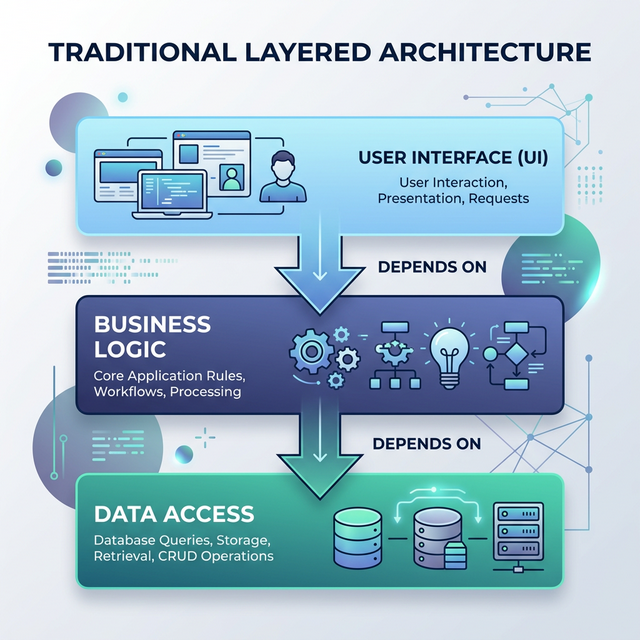
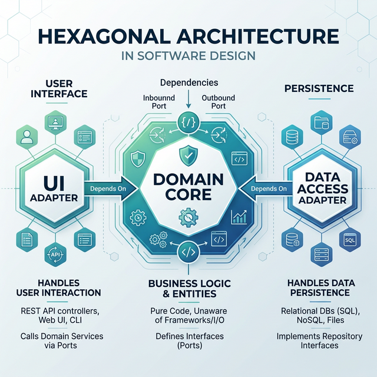
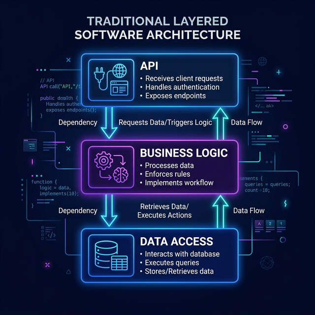
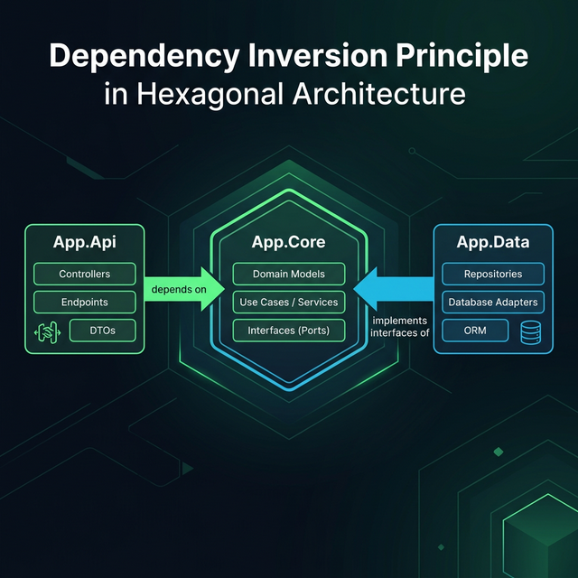

# Dependency Inversion Principle: The Foundation of Sustainable Architecture

**This is Part 1 of the .NET Architecture series.**

- **Part 1 — Dependency Inversion Principle: The Foundation of Sustainable Architecture** _(this post)_

- Part 2 — [Mastering Hexagonal Architecture in .NET: A Practical Guide](https://medium.com/@hieunv/mastering-hexagonal-architecture-in-net-a-practical-guide-6651752e6baa?source=friends_link&sk=91dc7ef74051997e2bbc7080f4aa5d93)

- Part 3 — [Dependency Injection: The Core Foundation for Implementing Dependency Inversion Principle](https://medium.com/@hieunv/dependency-injection-the-core-foundation-for-implementing-dependency-inversion-principle-8a2ef14cb82a?source=friends_link&sk=871b8238d962ac63569f66da223b29ae)

Not a Medium member? Keep reading for free by clicking [here](https://medium.com/@hieunv/dependency-inversion-principle-the-foundation-of-sustainable-architecture-d3f096c8a3ec?source=friends_link&sk=90c7967b4f244428c1e5319ff485654c).
---

## Introduction

In the field of software development, creating sustainable and maintainable code is always a challenge. The Dependency Inversion Principle (DIP) - one of the five SOLID principles - provides a solid foundation to address this challenge. This article will explain DIP in detail and illustrate how to apply it at the architectural level through a real project using Hexagonal Architecture (also known as Ports and Adapters).

## What is the Dependency Inversion Principle?

The Dependency Inversion Principle was proposed by Robert C. Martin and is stated as follows:

1. **High-level modules should not depend on low-level modules. Both should depend on abstractions.**
2. **Abstractions should not depend on details. Details should depend on abstractions.**

Simply put, DIP promotes "inverting" the traditional dependency flow in an application. Instead of core modules (like business logic) directly depending on technical modules (like databases or UI), we define interfaces in the core module and require technical modules to follow these interfaces.

## Why is DIP Important?

DIP brings many practical benefits:

1. **Loose coupling**: Modules are not tightly bound to each other, making it easy to change one part without affecting the entire system.

2. **Resilience**: When requirements change, only implementations need to be modified without changing the core business logic.

3. **Testability**: Dependencies can be easily mocked through interfaces to test business logic.

4. **Extensibility**: New implementations for existing interfaces can be added without modifying existing code.

5. **Maintainability**: Code becomes more understandable and maintainable thanks to clear separation of concerns.

## DIP at the Architectural Level: Hexagonal Architecture

Hexagonal Architecture is an architectural pattern proposed by Alistair Cockburn, applying DIP at the architectural level. In this architecture:

- **Domain Core**: Contains business logic and defines interfaces (ports) that other modules need to follow.
- **Adapters**: Implement interfaces defined by the domain core.

## Comparing Traditional Layered Architecture and Hexagonal Architecture

### Traditional Layered Architecture

Traditional layered architecture is typically organized in layers as follows:

1. **Presentation Layer (UI Layer)**: Handles user interactions
2. **Business Logic Layer**: Processes business logic
3. **Data Access Layer**: Manages database interactions

In this architecture, each layer depends on the layer below it, creating a one-way dependency flow from top to bottom. The main issues with this architecture:

- **One-way dependency**: Business Logic Layer directly depends on Data Access Layer, making it difficult to change the data storage method.
- **Complex testing**: Testing the Business Logic Layer requires mocking or creating an actual Data Access Layer.
- **Difficulty with changes**: Changes to a lower layer can affect all layers above it.

### Hexagonal Architecture (Ports and Adapters)

Hexagonal Architecture solves these problems by applying DIP at the architectural level:

1. **Domain Core (Hexagon)**: At the center, contains business logic and defines interfaces (ports) that it needs.
2. **Ports**: Interfaces defined by the Domain Core, specifying how to communicate with the outside world.
3. **Adapters**: Specific implementations of ports, connecting the Domain Core with external technical details.

Advantages of this architecture:

- **Separation of concerns**: Domain Core knows nothing about external technical details.
- **Inverted dependencies**: Technical details depend on the Domain Core, not the other way around.
- **Flexibility**: Easily change or add new adapters without affecting the Domain Core.
- **Simple testing**: Domain Core can be tested independently of adapters.

### Difference in Dependency Flow

The most important difference between the two architectures is the dependency flow:

- **Traditional Layered Architecture**:



Business Logic depends on Data Access.

- **Hexagonal Architecture**:



Both UI Adapter and Data Access Adapter depend on the Domain Core.

This is the clearest manifestation of the Dependency Inversion Principle at the architectural level.

## Sample Project Analysis

Our project is organized into the following modules:

```text
hexagon-dotnet-app/
├── src/
│   ├── App.Api/        # API Module - Handles HTTP endpoints
│   ├── App.Core/       # Core Module - Contains domain models and pure interfaces
│   ├── App.Data/       # Data Module - Implements repositories and data access
```

### 1. Core Module - The Center of the Architecture

The core module defines models and pure interfaces without depending on any specific data access framework or technology (like Entity Framework). This is an excellent illustration of the first principle of DIP: "High-level modules should not depend on low-level modules."

For example, in the core module, we define the `ITodoRepository` interface:

```csharp
// src/App.Core/Todo/ITodoRepository.cs
namespace App.Core.Todo;

public interface ITodoRepository : IRepository<TodoEntity, int>
{
    Task<IEnumerable<TodoEntity>> FindCompletedTodosAsync();
    Task<IEnumerable<TodoEntity>> FindIncompleteTodosAsync();
}
```

This interface defines what the core module needs from a repository storing to-do items, without caring about how it's implemented or what database powers it. This is a perfect example of the "abstraction" that DIP refers to.

While `TodoEntity` uses `System.ComponentModel.DataAnnotations` for validation attributes like `[Required]` and `[StringLength]`, this is a standard .NET assembly — not EF Core. All database-specific configuration (column names, indexes, seed data) lives in `AppDbContext.OnModelCreating` inside `App.Data`, keeping the core genuinely infrastructure-independent.

### 2. Data Module - Repository Implementation

The data module provides specific implementations for interfaces defined in the core module:

```csharp
// src/App.Data/Todo/TodoRepository.cs
using App.Core.Entities;
using App.Core.Todo;
using Microsoft.EntityFrameworkCore;

namespace App.Data.Todo;

public sealed class TodoRepository(AppDbContext dbContext) : ITodoRepository
{
    private AppDbContext DbContext { get; } = dbContext;

    public async Task<IEnumerable<TodoEntity>> FindCompletedTodosAsync()
    {
        return await DbContext
            .Todos.AsNoTracking()
            .Where(t => t.IsCompleted)
            .OrderByDescending(t => t.CreatedAt)
            .ToListAsync()
            .ConfigureAwait(false);
    }
    // Full implementation also includes CreateAsync, UpdateAsync,
    // DeleteAsync, FindByIdAsync, and FindIncompleteTodosAsync
}
```

Here, `TodoRepository` implements the `ITodoRepository` interface defined in the core module, providing the concrete details of how to query data using Entity Framework Core. This illustrates the second principle of DIP: "Details should depend on abstractions."

### 3. Relationship Between Modules

In traditional architecture, the dependency flow is typically:



Meaning business logic depends on data access, and API depends on business logic.

However, with DIP, the dependency flow is inverted:



Business logic defines the interfaces, and data access must conform to them — this is exactly the "inversion" that gives the principle its name.

In our project, the core module does not depend on the data module. Instead, the data module depends on the core module by implementing interfaces defined in the core module.

### 4. Practical Benefits

This approach brings clear benefits:

1. **Replaceability**: We can easily change the implementation of `TodoRepository` (e.g., from Entity Framework Core with SQL Server to MongoDB) without modifying the business logic.

2. **Simple testing**: Business logic can be tested by mocking repository interfaces, without needing an actual database.

3. **Architectural clarity**: Easy to understand the boundaries between layers and the responsibilities of each module.

## Applying DIP in Your Project

To effectively apply DIP in your project, follow these principles:

1. **Clearly identify the core domain**: Understand the core business logic of the application and separate it from technical details.

2. **Define interfaces in the core domain**: These interfaces represent what the core domain needs from the outside world.

3. **Implement interfaces in external modules**: Technical modules (database, UI, external services) must follow interfaces defined by the core domain.

4. **Use Dependency Injection**: Use DI to "inject" the concrete implementation into the core domain at runtime. In our project this is wired in `App.Data`:

```csharp
// src/App.Data/AppData.cs
builder.Services.AddScoped<ITodoRepository, TodoRepository>();
```

At runtime, whenever `ITodoRepository` is requested (e.g., by `TodoService`), the DI container provides `TodoRepository` — the core module never needs to know the concrete type.

5. **Organize project structure logically**: Clearly reflect the separation between layers and dependency flow.

## Conclusion

The Dependency Inversion Principle is not just a design principle — it is the foundation for sustainable and flexible software architecture. By applying DIP at the architectural level through Hexagonal Architecture, we can build applications that are highly adaptable to change, straightforward to test, and a pleasure to maintain.

Our sample project illustrates how DIP can be effectively applied in practice. By separating business logic from technical details and inverting the dependency flow, we create a robust architecture that can withstand the inevitable changes every software project faces.

Investing time to apply DIP may require more initial effort, but the long-term benefits in terms of maintainability and extensibility will prove it to be the right decision.
