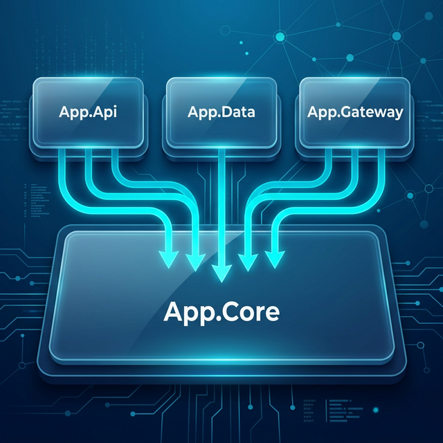
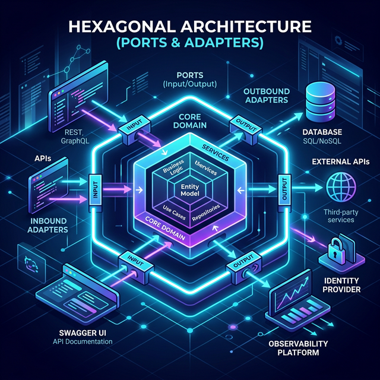

# Mastering Hexagonal Architecture in .NET — A Practical Guide

**This is Part 2 of the .NET Architecture series.**

- Part 1 — [Dependency Inversion Principle: The Foundation of Sustainable Architecture](https://medium.com/@hieunv/dependency-inversion-principle-the-foundation-of-sustainable-architecture-12345)

- **Part 2 — Mastering Hexagonal Architecture in .NET: A Practical Guide** _(this post)_

- Part 3 — [Dependency Injection: The Core Foundation for Implementing Dependency Inversion Principle](https://medium.com/@hieunv/dependency-injection-the-core-foundation-for-implementing-dependency-inversion-principle-8a2ef14cb82a?source=friends_link&sk=871b8238d962ac63569f66da223b29ae)

## Introduction

Have you ever had to change your database and realized it required touching 10 different files — some of which had nothing to do with persistence? Or swapped an HTTP client and found business logic scattered throughout? These are symptoms of a tightly coupled architecture.

**Hexagonal Architecture** (also known as Ports and Adapters), introduced by Alistair Cockburn in 2005, solves exactly this problem. It enforces a clear separation between your core business logic and the technical details that surround it — databases, HTTP clients, UI frameworks — so that each can evolve independently.

This article walks through a practical .NET implementation using C#, showing how the architecture works in real code and why it makes your application more maintainable, testable, and adaptable.

## What is Hexagonal Architecture?

Hexagonal Architecture separates the core business logic of an application from external technical details such as databases, user interfaces, or external services. It's visualized as a hexagon with:

- **Core Domain** at the center: containing business rules and logic
- **Ports**: interfaces allowing communication with the application
- **Adapters**: specific implementations of ports, connecting the domain with the outside world

The critical rule is **dependency direction flows inward only**. Outer layers know about inner layers, but the inner core never knows about the outside world:



`App.Core` has zero knowledge of databases, HTTP clients, or web frameworks. `App.Data`, `App.Gateway`, and `App.Api` all depend on `App.Core` — never the reverse.



## Project Structure

Our sample .NET project organizes modules by architectural role, with each module further subdivided by feature (Poke, Todo):

```
hexagon-dotnet-app/
├── src/
│   ├── App.Api/                            # Primary Adapters (HTTP)
│   │   ├── Poke/                           # Pokemon feature endpoints
│   │   └── Todo/                           # Todo feature endpoints
│   ├── App.Core/                           # Core Domain & Ports
│   │   ├── Entities/                       # Domain entities like TodoEntity
│   │   ├── Poke/                           # Pokemon domain logic and gateway interfaces
│   │   └── Todo/                           # Todo domain logic and repository interfaces
│   ├── App.Data/                           # Secondary Adapters (Database)
│   │   └── Todo/                           # Todo repository implementations
│   └── App.Gateway/                        # Secondary Adapters (External APIs)
│       └── Poke/                           # Pokemon API client implementations
```

Notice how `App.Core` is isolated at the center. HTTP APIs (`App.Api`), database access (`App.Data`), and HTTP clients (`App.Gateway`) are all adapters at the edges.

## Detailed Analysis of Each Module

### 1. Core Module — The Heart of the Architecture

The Core module contains business logic and domain entities. It defines the **Ports** (interfaces) that all other layers must implement. Crucially, `App.Core` depends on no other project in the solution.

Let's look at our base entity and the `TodoEntity`:

```csharp
// App.Core/Entities/Entity.cs
using System.ComponentModel.DataAnnotations;

namespace App.Core.Entities;

public abstract class Entity<T> : IEntity<T>
{
    [Key]
    public T? Id { get; set; }

    public DateTime CreatedAt { get; set; } = DateTime.UtcNow;

    public DateTime? UpdatedAt { get; set; }
}
```

```csharp
// App.Core/Entities/TodoEntity.cs
using System.ComponentModel.DataAnnotations;

namespace App.Core.Entities;

public class TodoEntity : Entity<int>
{
    [Required]
    [StringLength(
        200,
        MinimumLength = 1,
        ErrorMessage = "Title must be between 1 and 200 characters"
    )]
    public string Title { get; set; } = string.Empty;

    public DateOnly? DueBy { get; set; }

    public bool IsCompleted { get; set; }
}
```

Next, we define the repository interface (Port). This interface only speaks in domain concepts — it has no idea whether the data comes from SQL, NoSQL, or a file:

```csharp
// App.Core/Todo/ITodoRepository.cs
using App.Core.Entities;
using App.Core.Repositories;

namespace App.Core.Todo;

public interface ITodoRepository : IRepository<TodoEntity, int>
{
    Task<IEnumerable<TodoEntity>> FindCompletedTodosAsync();
    Task<IEnumerable<TodoEntity>> FindIncompleteTodosAsync();
}
```

### 2. Data Module — Secondary Adapter (Database)

The Data module implements the repository interfaces defined in `App.Core`. This is where EF Core, connection strings, and SQL specifics live — completely invisible to the domain.

By moving column name mappings out of `App.Core` entities and into `AppDbContext.OnModelCreating` via Fluent API, `App.Core` stays free of any infrastructure-specific knowledge:

```csharp
// App.Data/AppDbContext.cs
protected override void OnModelCreating(ModelBuilder modelBuilder)
{
    base.OnModelCreating(modelBuilder);

    modelBuilder.Entity<TodoEntity>(entity =>
    {
        // Column name mappings — kept in App.Data to preserve App.Core's independence
        entity.Property(e => e.Id).HasColumnName("ID");
        entity.Property(e => e.CreatedAt).HasColumnName("CREATED_AT");
        entity.Property(e => e.UpdatedAt).HasColumnName("UPDATED_AT");
        entity.Property(e => e.Title).HasColumnName("TITLE");
        entity.Property(e => e.DueBy).HasColumnName("DUE_BY");
        entity.Property(e => e.IsCompleted).HasColumnName("IS_COMPLETED");
    });

    // Indexes for common query patterns
    modelBuilder.Entity<TodoEntity>().HasIndex(t => t.IsCompleted);
    modelBuilder.Entity<TodoEntity>().HasIndex(t => t.DueBy);
}
```

The `TodoRepository` implementation is straightforward EF Core — all persistence details stay in `App.Data`:

```csharp
// App.Data/Todo/TodoRepository.cs
using App.Core.Entities;
using App.Core.Todo;
using Microsoft.EntityFrameworkCore;

namespace App.Data.Todo;

public sealed class TodoRepository(AppDbContext dbContext) : ITodoRepository
{
    private AppDbContext DbContext { get; } = dbContext;

    public async Task<IEnumerable<TodoEntity>> FindAllAsync()
    {
        return await DbContext
            .Todos.AsNoTracking()
            .OrderByDescending(t => t.CreatedAt)
            .ToListAsync()
            .ConfigureAwait(false);
    }

    // ... Other interface implementations (CreateAsync, UpdateAsync, DeleteAsync, etc.) ...
}
```

If you wanted to swap EF Core for Dapper or move to a NoSQL store, you would only change files in `App.Data`. `App.Core` and `App.Api` remain completely untouched.

### 3. API Module — Primary Adapter (HTTP)

The API module handles HTTP requests and responses, acting as the **primary adapter**. It translates external HTTP calls into operations on the core domain. Notice it depends only on `App.Core` types — it has no reference to `App.Data` or `App.Gateway`.

```csharp
// App.Api/Todo/TodoEndpoints.cs
using App.Core.Entities;
using App.Core.Todo;
using Microsoft.Extensions.Logging;

namespace App.Api.Todo;

internal sealed class TodoEndpoints(TodoService todoService, ILogger<TodoEndpoints> logger)
{
    // Primary constructor parameters are explicitly assigned as guarded backing fields
    private readonly TodoService _todoService =
        todoService ?? throw new ArgumentNullException(nameof(todoService));

    private readonly ILogger<TodoEndpoints> _logger =
        logger ?? throw new ArgumentNullException(nameof(logger));

    public async Task<IResult> FindAllTodosAsync()
    {
        _logger.LogInformation("Retrieving all todos");
        var todos = (await _todoService.FindAllAsync().ConfigureAwait(false)).ToList();
        var response = todos.Select(t => t.ToResponse());
        _logger.LogInformation("Successfully retrieved {TodoCount} todos", todos.Count);
        return Results.Ok(response);
    }

    // ... Other endpoints (GetById, Create, Update, Delete) ...
}
```

The null-guard throws (`?? throw new ArgumentNullException(...)`) on the backing fields follow defensive programming best practices. This is a common pattern when using C# primary constructors where you want to validate dependencies at construction time.

### 4. Gateway Module — Secondary Adapter (External Services)

The Gateway module implements patterns for interacting with external services or APIs, acting as another secondary adapter.

First, the pure domain model and gateway interface in `App.Core`:

```csharp
// App.Core/Poke/Pokemon.cs
namespace App.Core.Poke;

public class Pokemon
{
    public string Name { get; set; } = string.Empty;
    public Uri? Url { get; set; }
}
```

```csharp
// App.Core/Poke/IPokemonGateway.cs
namespace App.Core.Poke;

public interface IPokemonGateway
{
    Task<IEnumerable<Pokemon>?> FetchPokemonListAsync(int limit = 20, int offset = 0);
    Task<Pokemon?> FetchPokemonByIdAsync(int id);
}
```

The gateway implementation in `App.Gateway` uses two kinds of internal DTOs that mirror the third-party PokeAPI's JSON shape:

- `PokeResponse<T>` — a shared paginated wrapper in `App.Gateway.Client`, reused across different response types
- `PokemonItem` and `PokemonDetail` — internal classes inside `PokemonGateway` for specific endpoint responses

These DTOs are purely implementation details of the `App.Gateway` module. The domain model only ever sees the clean `Pokemon` type defined in `App.Core`:

```csharp
// App.Gateway/Client/PokeResponse.cs
namespace App.Gateway.Client;

public class PokeResponse<T>
{
    public int Count { get; set; }
    public string? Next { get; set; }
    public string? Previous { get; set; }
    public IReadOnlyList<T> Results { get; init; } = [];
}
```

```csharp
// App.Gateway/Poke/PokemonGateway.cs
using App.Core.Poke;
using App.Gateway.Client;

namespace App.Gateway.Poke;

public class PokemonGateway(IPokeClient pokeClient) : IPokemonGateway
{
    private readonly IPokeClient _pokeClient =
        pokeClient ?? throw new ArgumentNullException(nameof(pokeClient));

    public async Task<IEnumerable<Core.Poke.Pokemon>?> FetchPokemonListAsync(
        int limit = 20,
        int offset = 0
    )
    {
        var url = new Uri($"pokemon?limit={limit}&offset={offset}", UriKind.RelativeOrAbsolute);
        var response = await _pokeClient
            .GetAsync<PokeResponse<PokemonItem>>(url)
            .ConfigureAwait(false);

        if (response == null || response.Results == null)
        {
            return null;
        }

        // Map the external DTO to the clean domain model before returning
        return response.Results
            .Select(item => new Core.Poke.Pokemon
            {
                Name = item.Name,
                Url = new Uri(item.Url, UriKind.RelativeOrAbsolute)
            })
            .ToList();
    }

    public async Task<Core.Poke.Pokemon?> FetchPokemonByIdAsync(int id)
    {
        var url = new Uri($"pokemon/{id}", UriKind.RelativeOrAbsolute);
        var response = await _pokeClient.GetAsync<PokemonDetail>(url).ConfigureAwait(false);

        if (response == null)
        {
            return null;
        }

        return new Core.Poke.Pokemon
        {
            Name = response.Name,
            Url = new Uri($"pokemon/{id}/", UriKind.RelativeOrAbsolute),
        };
    }

    // Internal DTOs — private implementation details, never exposed outside this module
    internal class PokemonItem
    {
        public string Name { get; set; } = string.Empty;
        public string Url { get; set; } = string.Empty;
    }

    internal class PokemonDetail
    {
        public int Id { get; set; }
        public string Name { get; set; } = string.Empty;
        public int Height { get; set; }
        public int Weight { get; set; }
    }
}
```

## Data Flow in Hexagonal Architecture

Let's follow the flow of an HTTP request from start to finish:

1. **HTTP Request** → Minimal API Endpoint in `App.Api` (Primary Adapter)
2. Endpoint validates the request, maps external DTOs, and calls the `App.Core` Service
3. **Service** in `App.Core` processes core business logic
4. Service calls a Repository or Gateway interface (Port) to interact with persistence or external APIs
5. **Adapter Implementation** (`App.Data` or `App.Gateway`) translates the core request to a database query or external HTTP call
6. Data flows back: Adapter → Service → Endpoint → HTTP Response

At no point does `App.Core` know which database, HTTP client, or web framework is in use.

## Testability: The Core in Isolation

One of the biggest advantages is how cleanly the Core can be unit-tested. Because `TodoService` depends only on the `ITodoRepository` interface (a Port), you can mock it completely — no database required:

```csharp
// App.Core.Tests/Todo/TodoServiceTests.cs
public class TodoServiceTests
{
    private readonly Mock<ITodoRepository> _todoRepositoryMock;
    private readonly TodoService _todoService;

    public TodoServiceTests()
    {
        _todoRepositoryMock = new Mock<ITodoRepository>();
        _todoService = new TodoService(_todoRepositoryMock.Object);
    }

    [Fact]
    public async Task FindAllAsync_ShouldReturnAllTodos()
    {
        // Arrange
        var expectedTodos = new List<TodoEntity>
        {
            new() { Id = 1, Title = "Test Todo 1", IsCompleted = false },
            new() { Id = 2, Title = "Test Todo 2", IsCompleted = true },
        };

        _todoRepositoryMock.Setup(x => x.FindAllAsync()).ReturnsAsync(expectedTodos);

        // Act
        var result = await _todoService.FindAllAsync();

        // Assert
        Assert.Equal(expectedTodos, result);
        _todoRepositoryMock.Verify(x => x.FindAllAsync(), Times.Once);
    }
}
```

This test exercises real business logic in `TodoService` without any database connection, EF Core configuration, or HTTP infrastructure. The same pattern applies to `PokemonService` — mock `IPokemonGateway` and test pure domain behavior.

## Benefits of Hexagonal Architecture

1. **High Maintainability**: Business logic is completely separated from technical implementations, making it simple to evolve either side independently.
2. **Technology Agnosticism**: You can swap your database ORM (e.g., from EF Core to Dapper) or replace an HTTP client without touching `App.Core`.
3. **Excellent Testability**: `App.Core` can be fully unit-tested without any external dependencies — just mock the Port interfaces.
4. **Parallel Development**: Frontend/API teams and database teams can work in parallel once the Core interfaces (Ports) are defined.

## Conclusion

Hexagonal Architecture provides a strongly decoupled approach for complex application development. By defining clear boundaries (Ports) around the Domain (Core) and pushing infrastructure details to the edges (Adapters in Data, Gateway, and API), you produce robust, testable, and adaptable C# applications.

Our sample solution enforces this structurally using separate .NET class libraries (`App.Core`, `App.Api`, `App.Data`, `App.Gateway`). The compiler itself guarantees that `App.Core` can never accidentally import from `App.Data` — the architecture isn't just a convention, it's enforced by project references.

The result: when requirements change, you change in one place. When technology evolves, you swap one adapter. When bugs appear, you test in isolation. That's the power of Ports and Adapters.
