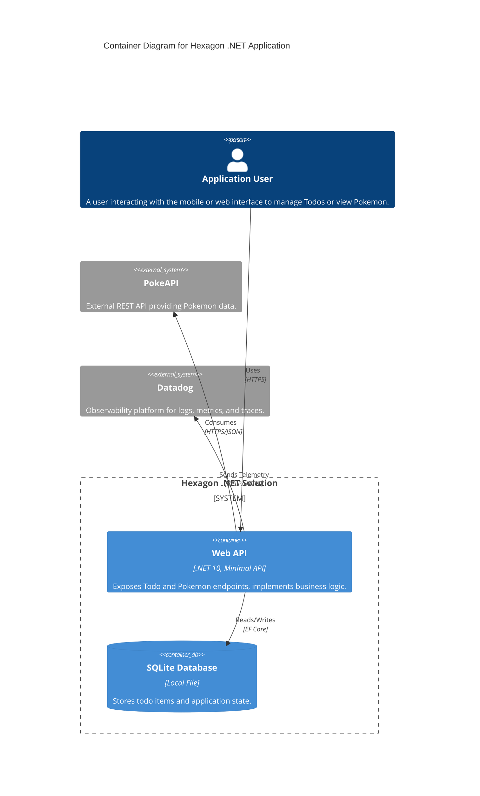

# C4 Container Diagram

This diagram provides a high-level view of the application's containers (applications, databases, etc.) and their relationships.

## Containers

- **Web API**: The main entry point for the system. It handles HTTP requests, authenticates users, and coordinates between the database and external services.
- **SQLite Database**: A persistent storage system for managing Todo items.
- **PokeAPI**: A third-party external service used to fetch Pokemon details.
- **Datadog**: External observability platform used for monitoring system health and performance.
 village
