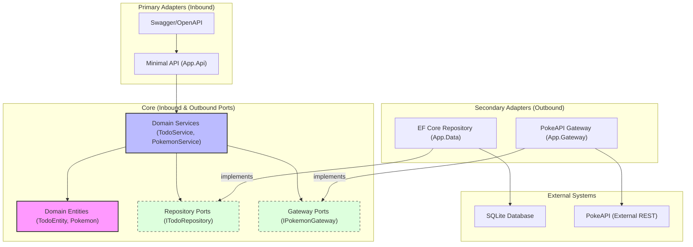

# Hexagonal Architecture Diagram

This diagram visualizes the application's structure following the Hexagonal Architecture (Ports and Adapters) pattern.

## Key Components

- **Domain Entities**: Core business objects and logic.
- **Domain Services**: Business workflows that coordinate domain entities and ports.
- **Ports (Interfaces)**: Define how the core interacts with the outside world (Repository Port, Gateway Port).
- **Primary Adapters**: Entry points to the application (API endpoints).
- **Secondary Adapters**: Implementations of ports that talk to external infrastructure.
