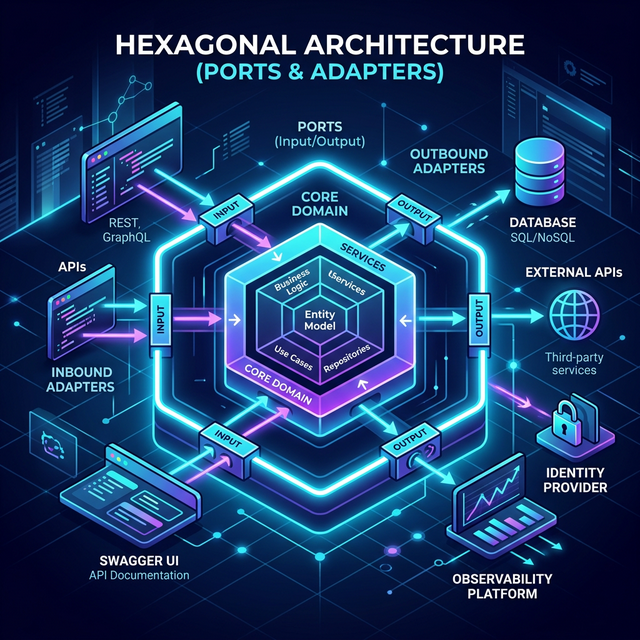

# Hexagonal .NET Application Architecture

This document visualizes the **Hexagonal Architecture** (also known as Ports and Adapters) of the `hexagon-dotnet-app` project. It provides a structured approach to building maintainable and testable ASP.NET Core applications by separating business logic from external concerns.

## 🔷 The Core (Domain & Services)

At the center of our system lies the **Core**. This area is strictly isolated from infrastructure dependencies (like the database or external APIs). It only depends on its own internal rules.

- **Domain Entities**: The foundational data objects (e.g., `TodoEntity`, `Pokemon`) that encapsulate the state and basic business rules.
- **Domain Services**: The orchestrators of business logic (e.g., `TodoService`, `PokemonService`). They coordinate operations between entities and ports.
- **Ports (Interfaces)**: Inbound and outbound contracts defined by the core.
  - *Outbound Ports*: Interfaces like `ITodoRepository` and `IPokemonGateway`.
  - *Inbound Ports*: Use cases exposed to primary adapters.

## ➡️ Primary (Inbound) Adapters

Primary adapters drive the application by invoking the core's inbound ports.

- **Minimal APIs (App.Api)**: The RESTful endpoints exposing functionality to clients.
- **Swagger UI**: The interactive API documentation and testing interface.

These components translate incoming HTTP requests into commands that the core can understand.

## ⬅️ Secondary (Outbound) Adapters

Secondary adapters are driven *by* the core. They implement the outbound ports (interfaces) defined in the core layer independently.

- **Entity Framework Core (App.Data)**: Implements `ITodoRepository` and handles the mapping of domain entities to the SQLite database.
- **PokeAPI Gateway (App.Gateway)**: Implements `IPokemonGateway`, encapsulating the raw HTTP calls to the external REST service into domain-friendly responses.

## 🌍 External Systems & Infrastructure

The outermost layer consists of the actual external entities our application interacts with:

- **SQLite Database**: Local file-based fast relational data storage.
- **Keycloak SSO**: External Identity and Access Management (IAM) handling authentication.
- **PokeAPI**: Third-party REST API that provides Pokémon data.
- **Datadog**: Cloud observability platform receiving distributed traces, metrics, and structured logs via OTLP.

By enforcing the Dependency Inversion Principle, the core never references adapters directly. Instead, adapters reference and implement the core ports, ensuring long-term maintainability, independent deployability, and high testability across the entire software lifecycle.
